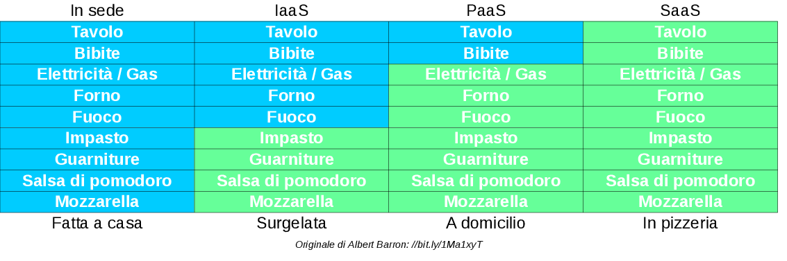
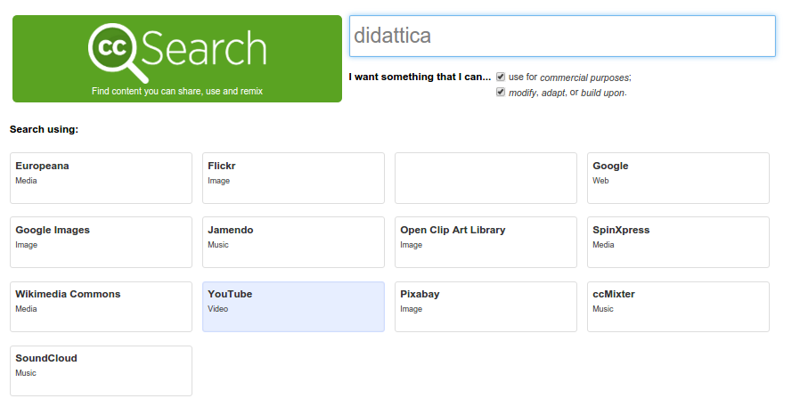

% Nuove risorse digitali e\ didattica
% Loris Tissino  
 @loristissino 
% Aprile 2016

# TIC vs TAC

## TIC

Tecnologie dell'Informazione e della Comunicazione

(focus sullo strumento)

## TAC

Tecnologie dell'Apprendimento e della Conoscenza

(focus sulla _mission_ dell'insegnante)

## Si impara meglio se...

- si ha un ruolo attivo
- si svolge un'attività
- si costruisce un prodotto
- si collabora
- si rappresenta ciò che si è appreso

-------------------

## SAMR

- _Substitution_: es. scrittura al computer anziché su carta
- _Augmentation_: es. elaboratore testi con immagini, inserimento immagini, link interni ed esterni
- _Modification_: es. scrittura collaborativa
- _Redefinition_: es. pubblicazione su blog, interazione con esterni, ecc.

# Software / Hardware

## Software

- applicazioni desktop
- applicazioni web
- app per dispositivi mobili
- bot

--------------

## Fattori da considerare

- software libero (open source) / proprietario
- costo del servizio
- età minima utenti
- multipiattaforma o meno
- solo desktop o multidevice
- possibilità di importazione / esportazione dati  
da/verso formati standard
- uso online / offline

## Hardware

- computer
- smartphone
- tablet
- lavagne interattive
- sistemi per fruizione di contenuti mm
- microcontrollori (arduino, raspberry pi)
- IoT
- robot

# Modelli

## Broadcasting

- lezioni frontali
- metodo trasmissivo
- moduli
- test

## E-Learning

- _learning objects_
- forum
- test on line

## Blended learning

- piattaforme digitali
- strumenti tipici dell'e-learning
- ... in aggiunta alla modalità tradizionale

## Classe capovolta

- lezioni online seguite a casa
- esercitazioni a scuola
- BYOD - Bring Your Own Device (non necessariamente)

# Produzione di contenuti

## Da parte del docente

- tempi lunghi?
- competenze tecniche?
- diritti?

## Da parte degli allievi

- come valutare i lavori?
- come distinguere abilità tecniche da competenze disciplinari?

## Pubblicazione

- violazioni diritti d'autore?
- contenuti errati?
- forme discutibili?
- chi ha la responsabilità dei contenuti pubblicati?

# Piattaforme

## Piattaforme per\ l'organizzazione\ didattica

- lezioni
- compiti
- quiz
- sondaggi
- discussioni

## Edmodo.com

[edmodo.com](https://www.edmodo.com)  
[Video: intervista a Lucia Bartolotti](https://www.youtube.com/watch?v=94TUDEF-mJs)

## Google Apps for Education

[google.com/edu](https://www.google.com/edu/)

## Moodle

[moodle.org](https://moodle.org/)

## Altre...

- [BlackBoard](http://uki.blackboard.com/)
- [Desire2Learn](http://www.d2l.com/)
- [Schoology](https://www.schoology.com/)
- [Canvas](https://www.canvaslms.com/)

## Problema

Ci deve essere uniformità nelle soluzioni offerte dal\ consiglio\ di\ classe!

# Strumenti utili

## Dropbox

[dropbox.com](https://dropbox.com)

## Kahoot

[kahoot.com](https://getkahoot.com/)

## Quizlet

[quizlet.com](https://quizlet.com)

# Risorse on line

## Risorse didattiche aperte

- licenze libere ([Creative Commons](http://www.aliprandi.org/manuale-cc/html/), GNU FDL)
- apertura tecnica (codice sorgente)

[Pagina su Wikipedia](https://it.wikipedia.org/wiki/Risorse_didattiche_aperte)

## Ricerche di contenuti CC

## Risorse utili

- MOOC
- [Wikibooks](https://it.wikibooks.org)
- [Wikiversità](https://it.wikiversity.org)
- [TED](http://www.ted.com/), [TEDEd](http://ed.ted.com/)
- [RaiScuola](http://www.raiscuola.rai.it/)
- [OilProject](http://www.oilproject.org/)
- [FedericaMOOC](http://www.federica.unina.it/)
- [Europeana](http://www.europeana.eu/)
- [OpSound](http://opsound.org/)

# Scrittura collaborativa

## Insieme

- commenti
- correzioni
- cronologia

## In tempo reale

Etherpad/[piratepad](http://piratepad.net/)

## Documenti condivisi

WYSIWYG

## Strumenti basati su [vc](https://it.wikipedia.org/wiki/Controllo_versione)

WYWIWYM  
MarkDown, anybody?

[pandoc.org](http://pandoc.org/)

# Presentazioni

## Strumenti

- [Prezi](https://prezi.com/)
- [PowToon](https://www.powtoon.com)
- [Impress.js](http://impress.github.io/impress.js)

# Raccolte

## Link utili

- [EdShelf](https://edshelf.com/)
- [MERLOT](https://www.merlot.org)
- [Edutopia](http://www.edutopia.org/open-educational-resources-guide)
- [OERCommons](https://www.oercommons.org/)
- [EnergizeEducation](http://energizeeducation.org/)
- [Essediquadro](http://sd2.itd.cnr.it/)
- [M_Learning class](http://mlearning.isitgoonair.net/)

## Spunti

- [Webtrotter](http://domino.aicanet.it/aica/ecdlcompetition.nsf)

# Colophon

## Sorgente

[Questo documento](https://raw.githubusercontent.com/loristissino/risorsedigitali/master/index.md)

## Strumenti

- [Reveal.js](http://lab.hakim.se/reveal-js)
- [Pandoc](http://www.pandoc.org)

## Licenza

 «Nuove risorse digitali e didattica» di <a xmlns:cc="http://creativecommons.org/ns#" href="http://www.tissino.it/risorsedigitali/" property="cc:attributionName" rel="cc:attributionURL">Loris Tissino</a> è distribuito con Licenza  <a rel="license" href="http://creativecommons.org/licenses/by-sa/4.0/">Creative Commons Attribuzione Condividi allo stesso modo 4.0 Internazionale</a>.
