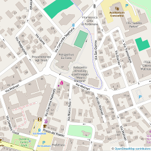
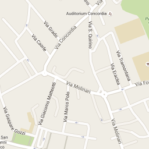

% Nuove risorse digitali e\ didattica
% Loris Tissino
   @loristissino 
  _loris@tissino.it_
% Aprile 2021

# DAD vs DDI

## DAD

Didattica a Distanza

(uso esclusivo di piattaforme digitali)

## DDI

Didattica Digitale Integrata

(integrazione tra didattica a distanza e in presenza)

# TIC vs TAC

## TIC

Tecnologie dell'Informazione e della Comunicazione

(focus sullo strumento)

## TAC

Tecnologie dell'Apprendimento e della Conoscenza

(focus sulla _mission_ dell'insegnante)

## Si impara meglio se...

- si ha un ruolo attivo
- si svolge un'attività
- si costruisce un prodotto
- si collabora
- si rappresenta ciò che si è appreso
- si viene gratificati

-------------------

## Digitale vs Analogico

## SAMR

- _Substitution_: es. scrittura al computer anziché su carta
- _Augmentation_: es. elaboratore testi con immagini, inserimento immagini, link interni ed esterni
- _Modification_: es. scrittura collaborativa
- _Redefinition_: es. pubblicazione su blog, interazione con esterni, ecc.

# Software / Hardware

## Software

- applicazioni desktop
- applicazioni web
- applicazioni su singola pagina
- plugin per [CMS](https://it.wikipedia.org/wiki/Content_management_system)
- app per dispositivi mobili
- bot

--------------

## Fattori da considerare

- software libero (open source) / proprietario
- costo del servizio, modello di business (pubblicità?)
- accessibilità, rappresentazioni multiple
- _gamification_
- età minima utenti
- multipiattaforma o meno
- solo desktop o multidevice
- uso online / offline
- possibilità di importazione / esportazione dati  
da/verso formati standard (_lock-in?_)
- possibilità di usare [API](https://it.wikipedia.org/wiki/Application_programming_interface)

## Hardware

- computer
- server di rete
- macchine virtuali
- NAS
- smartphone
- tablet
- lavagne interattive
- sistemi per fruizione di contenuti mm
- microcontrollori (Arduino, Raspberry PI, Espruino)
- strumenti IoT
- robot

# Modelli

## Broadcasting

- lezioni frontali
- metodo trasmissivo
- moduli
- test

## E-Learning

- _learning objects_
- forum
- test on line

## _Blended Learning_

- piattaforme digitali
- strumenti tipici dell'e-learning
- ... in aggiunta alla modalità tradizionale

## Classe capovolta

- lezioni online seguite a casa
- esercitazioni a scuola
- BYOD - _Bring Your Own Device_ (non necessariamente)

## _Project Based Learning_

- contenuti standard + pensiero critico, _problem solving_, collaborazione, organizzazione
- problema/domanda _sfidante_ (_non googlabile_)
- necessità di investigazione
- autenticità del problema
- possibilità di più soluzioni corrette
- riflessione
- critica e revisione
- pubblicazione di un prodotto
- valutazione [su diversi aspetti](https://www.edutopia.org/stw-project-based-learning-best-practices-guide)

## Valutazione di fonti e contenuti

- contrasto di _fake news_ ([Unesco](https://en.unesco.org/fightfakenews))
- individuare le teorie del complotto ([Unione Europea](https://ec.europa.eu/info/identifying-conspiracy-theories_it))
- debunking ([Skeptical Science](https://skepticalscience.com/docs/DebunkingHandbook2020-Italian.pdf))
- let's play! ([Bad News](https://www.getbadnews.com/#intro))

# Produzione di contenuti

## Da parte del docente

- tempi lunghi?
- competenze tecniche?
- diritti?

## Da parte degli allievi

- come valutare i lavori?
- come distinguere le abilità tecniche dalle competenze disciplinari?

## Pubblicazione

- violazioni diritti d'autore?
- contenuti errati?
- forme discutibili?
- chi ha la responsabilità dei contenuti pubblicati?

# Piattaforme

## Piattaforme per\ l'organizzazione\ didattica

- lezioni
- compiti
- quiz
- sondaggi
- discussioni

## Edmodo.com
  
[edmodo.com](https://www.edmodo.com)  
[Video: intervista a Lucia Bartolotti](https://www.youtube.com/watch?v=94TUDEF-mJs)

## Google Workspace for Education

[edu.google.com](https://edu.google.com/)

## Moodle

[moodle.org](https://moodle.org/)

## E-Twinning

[etwinning.net](https://www.etwinning.net)

## Altre...

- [BlackBoard](http://uki.blackboard.com/)
- [Desire2Learn](http://www.d2l.com/)
- [Schoology](https://www.schoology.com/)
- [Canvas](https://www.canvaslms.com/)
- [WeSchool](http://www.weschool.com)
- _diverse_ piattaforme per libri digitali
- registri elettronici

## Problema

Ci deve essere uniformità nelle soluzioni offerte dal\ consiglio\ di\ classe!

# (Alcuni) strumenti utili

## Depositi di file

[dropbox.com](https://dropbox.com)   
[wetransfer.com](https://wetransfer.com/)

## Quiz

[kahoot.com](https://getkahoot.com/)  
[quizlet.com](https://quizlet.com)  
[socrative.com](https://socrative.com/)  

## Infografiche

[Easel.ly](https://www.easel.ly)

## Web conference

[Apache OpenMeetings](https://openmeetings.apache.org/demo.html)  
[Jitsi](https://meet.jit.si/)  
[BBB](https://scuolalibera.continuity.space/)  

# Risorse on line

## Risorse didattiche aperte

- uno [sguardo d'insieme](https://www.mindomo.com/it/mindmap/contenuti-digitali-aperti-tra-licenze-inclusione-e-riuso-6a46a306c55c43f1a95e6b4e11acaea5)
- licenze libere ([Creative Commons](http://www.aliprandi.org/manuale-cc/html/), GNU FDL)
- apertura tecnica (codice sorgente)

[Pagina su Wikipedia](https://it.wikipedia.org/wiki/Risorse_didattiche_aperte)

## Ricerche di contenuti CC

## Mappe geografiche

 

## Mappe cognitive 

- [Wiki2Map](https://wiki2map.org/)
- [Mindomo](https://www.mindomo.com)

## Rappresentazioni

- [umap](https://umap.openstreetmap.fr/en/)
- [datawrapper](https://www.datawrapper.de/)
- [wikiMap](https://wiki-map.com/map/?locale=it&lat=45.8660&lng=13.7785)
- [d3](https://d3js.org/)
- [streamlit](https://streamlit.io/)

## Risorse utili

- MOOC
- [Wikibooks](https://it.wikibooks.org)
- [Wikiversità](https://it.wikiversity.org)
- [TED](http://www.ted.com/), [TEDEd](http://ed.ted.com/)
- [RaiScuola](http://www.raiscuola.rai.it/)
- [OilProject](http://www.oilproject.org/)
- [FedericaMOOC](http://www.federica.unina.it/)
- [Europeana](http://www.europeana.eu/)
- [OpSound](http://opsound.org/)

# Scrittura collaborativa

## Insieme

- commenti
- correzioni
- cronologia

## In tempo reale

Etherpad/[piratepad](http://piratepad.net/)

## Documenti condivisi

WYSIWYG

## Strumenti basati su [vc](https://it.wikipedia.org/wiki/Controllo_versione)

WYWIWYM  
MarkDown, anybody?

[pandoc.org](http://pandoc.org/)

# Presentazioni

## Strumenti

- [Prezi](https://prezi.com/)
- [PowToon](https://www.powtoon.com)
- [Impress.js](http://impress.github.io/impress.js)
- [Reveal.js](http://lab.hakim.se/reveal-js/#/)

# Raccolte

## Link utili

- [EdShelf](https://edshelf.com/)
- [MERLOT](https://www.merlot.org)
- [Edutopia](http://www.edutopia.org/open-educational-resources-guide)
- [OERCommons](https://www.oercommons.org/)
- [EnergizeEducation](http://energizeeducation.org/)
- [Essediquadro](http://sd2.itd.cnr.it/)
- [M_Learning class](http://mlearning.isitgoonair.net/)

## Spunti

- [Webtrotter](http://domino.aicanet.it/aica/ecdlcompetition.nsf)

# Colophon

## Sorgente

[Questo documento](https://raw.githubusercontent.com/loristissino/risorsedigitali/master/index.md)

## Strumenti

- [Reveal.js](http://lab.hakim.se/reveal-js)
- [Pandoc](http://www.pandoc.org)

## Licenza

 «Nuove risorse digitali e didattica» di <a xmlns:cc="http://creativecommons.org/ns#" href="http://www.tissino.it/risorsedigitali/" property="cc:attributionName" rel="cc:attributionURL">Loris Tissino</a> è distribuito con Licenza  <a rel="license" href="http://creativecommons.org/licenses/by-sa/4.0/">Creative Commons Attribuzione Condividi allo stesso modo 4.0 Internazionale</a>.
